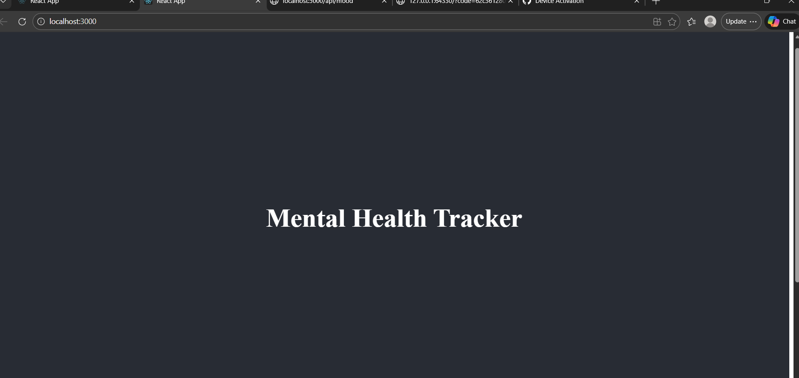
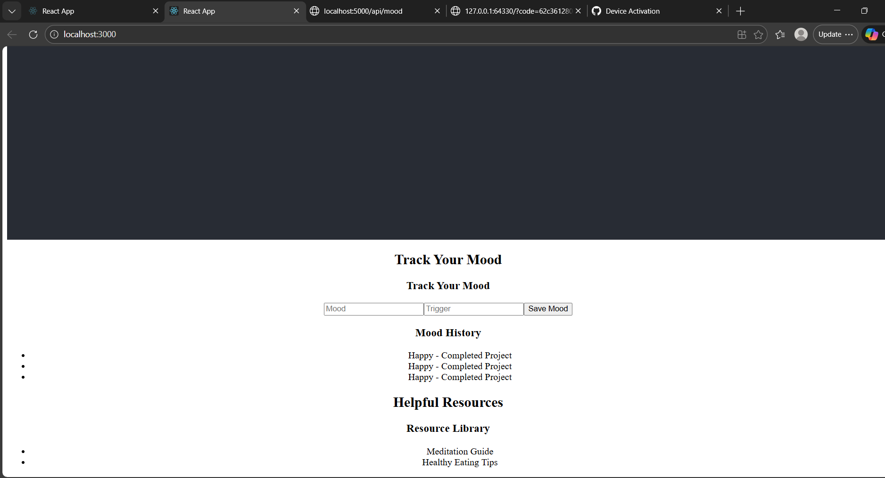

# Mental Health Tracker (MERN Stack)

A full-stack **Mental Health Tracker** web application built with the MERN stack.  
Track daily moods, triggers, and view mood history. Includes helpful mental health resources.  

---

## Features
- Track daily moods (Happy, Sad, etc.)
- Save mood triggers
- View mood history with date
- Delete moods
- Helpful resources section

---

## Tech Stack
- **Frontend:** React.js
- **Backend:** Node.js, Express.js
- **Database:** MongoDB
- **Version Control:** Git & GitHub

---
## Screenshots

**Home Page:**  

**Mood Tracker:**  

